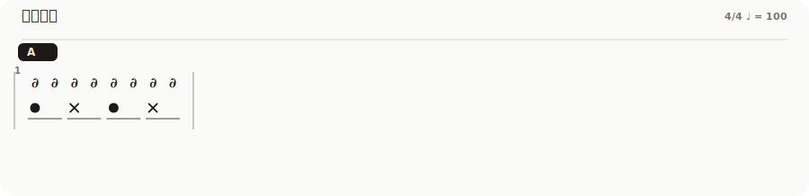
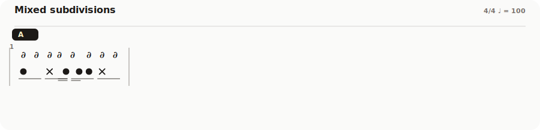
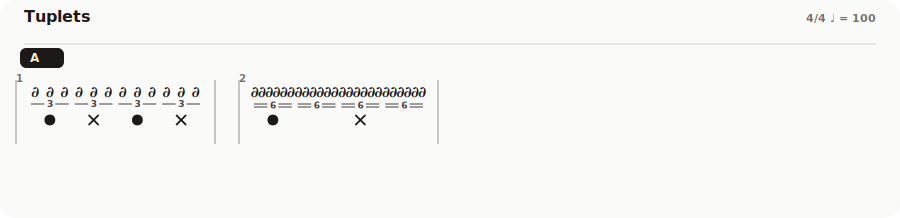
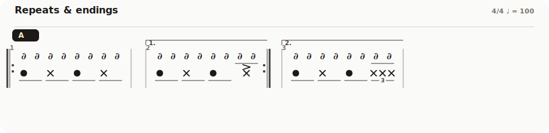
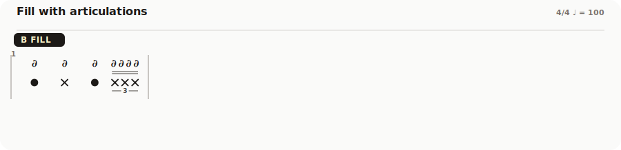

# Drumit

> 白天练，夜里扒，做梦都在找鼓点打。
> 一个鼓谱工具，给不想啃五线谱的人。

[English](./README.en.md) · 中文

[](https://w-mai.github.io/Drumit/)


## 为什么写这个

我不是专业鼓手，五线谱苦手，看到一堆线就晕。但我想扒歌、想练。

Drumit 的思路：镲类一行、鼓类一行；声部撞了才多拆几行；符干省掉。
源文件叫 `.drumtab`，纯文本，能 diff、能 copy-paste、能提 PR。

## 长这样

**基础 8 分律动 · 动次打次**



**拍内混合细分 + 多声部**



**三连音、六连音**



**反复记号 + 一房、二房**



**带各种修饰的 fill**



## 跑起来

```bash
bun install
bun run dev      # http://localhost:5173
bun run test
bun run build    # → dist/
bun run samples:generate   # 重新渲染 README 里的这几张 svg
```

需要 [Bun](https://bun.sh) ≥ 1.3。

## `.drumtab` 怎么写

```drumtab
title: 动次打次
tempo: 100
meter: 4/4

[A]
| hh: oo / oo / oo / oo  bd: o- / -- / o- / --  sn: - / x- / - / x- |
```

| 写法 | 意思 |
|---|---|
| `\| ... \|` | 一个小节 |
| `hh: a / b / c / d` | 一条声部（踩镲），拍与拍之间用 `/` 隔开 |
| `oo` / `oooo` / `ooo` | 一拍内平均切分（8 分、16 分、三连音） |
| `o , x x` | 一拍内拼不同时值（8 分 + 两个 16 分） |
| `\|: ... :\| x3` | 反复 3 次 |
| `... \| [1]` / `... \| [2]` | 一房 / 二房 |
| `@segno` / `@dc al fine` | D.S./D.C./Coda/Fine 跳转 |
| `>o` / `(o)` / `fo` / `~o` / `o!` | 重音 / ghost / flam / 滚奏 / 闷音 |
| `o/R` / `o/L` | 右手 / 左手 |

完整规则写在 `src/notation/parser.ts`，更多范例看 `samples/*.drumtab`。

## 有啥能玩

- **可视化编辑器**：点格子输入、数字键切乐器、修饰键加 ghost/flam；每篇独立撤销/重做；也能直接改 `.drumtab` 原文
- **可视化渲染**：beam 跨声部自动合并、三连音数字嵌在 beam 中间、反复点、D.C./D.S./Fine/Coda 一应俱全
- **播放**：内置 Web Audio 合成鼓，或直连 Web MIDI；后台标签不掉速（调度跑在 Worker 里）；节拍器、循环、播放光标都有
- **导出**：SVG、PNG、PDF、静态 HTML、**可播 HTML**（内嵌 Play 按钮，离线也能响）、`.drumtab`、`.mid`
- **多谱子工作区**：侧栏切换，`.drumtab` 自由进出，localStorage 自动存档
- **手机上也能看**：布局响应到 320px，侧栏变抽屉、播放条沉底；编辑功能桌面独享

更新记录在 [CHANGELOG.md](./CHANGELOG.md)。

## 用了啥

Bun + Vite + React 19 + TypeScript 6 + Tailwind v4 + Vitest。

## 鸣谢

感谢 **董波老师**。Drumit 采用的这套两行压缩鼓谱记法 ——
镲类在上、鼓类在下、符干全省、一拍切若干格 —— 正是我在小米音乐社团
跟董老师学打鼓时记下来的那套东西。
他的谱面简单、直接、好读，真正做到了拿起就能打。
这个项目本质上就是想把那种手写谱的体验搬到屏幕上。

## 协议

[MIT](./LICENSE) © 2026 W-Mai
